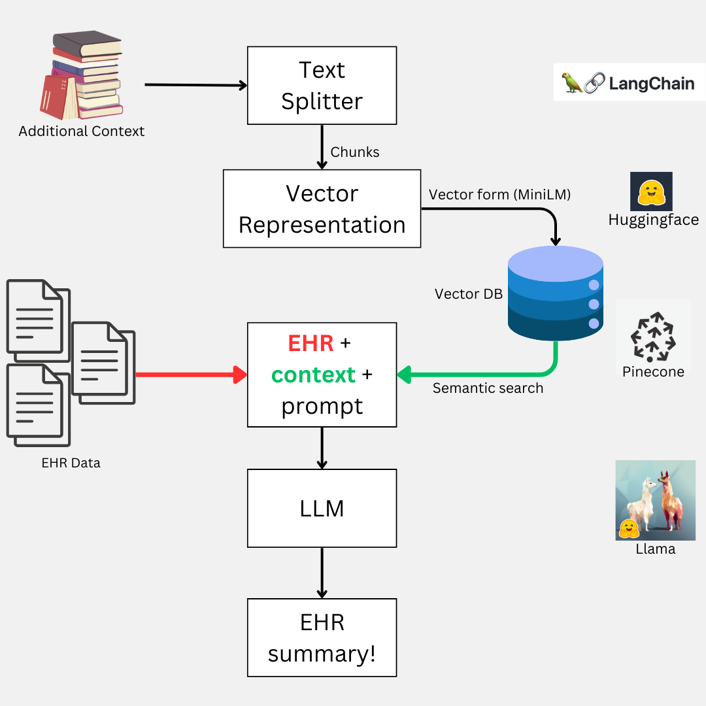
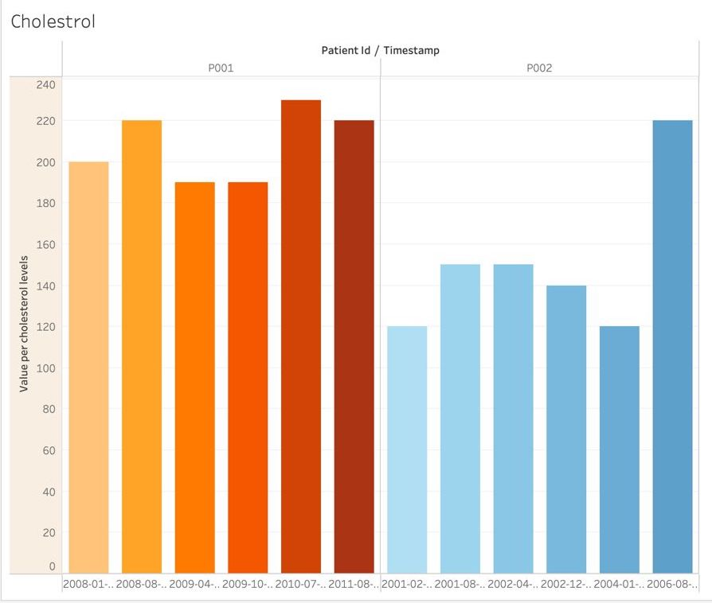

# SmartCare
### Revolutionizing Healthcare with AI-Driven Patient Data Summaries

## Understanding the Theme
### This project seems to fit well within the healthcare and wellness theme of the hackathon as it tackles real-world inefficiencies in healthcare and aims to improve both clinical workflows and patient care. With the right data and model, this can be an achievable project within a hackathon timeframe. 
* Clinicians typically spend an average of 16 minutes per patient encounter, dedicating a significant portion of that time to chart review (33%), documentation (24%), and ordering (17%).
* This involves going through extensive past medical reports to form conclusions.
* This process consumes valuable time that could otherwise be utilized for direct patient care or attending to other patients.
* By providing a pre-summarized version of this information, both patients and doctors can save time, ensuring that essential questions are addressed beforehand and allowing healthcare professionals to focus more efficiently on treatment solutions.

## The SmartCare Way

## Funtionality

* **Longitudinal Heart Health Tracking**: SmartCare includes advanced heart analysis features that allow clinicians to monitor and assess a patient's cardiovascular health over time. By evaluating historical data and identifying trends, SmartCare delivers actionable insights into the progression of heart conditions, helping healthcare professionals make informed, proactive decisions.

* **Automated Chart Review**: SmartCare leverages cutting-edge generative AI to streamline the time-consuming process of reviewing comprehensive patient records. It intelligently extracts key medical insights from various health parameters, providing clinicians with an easy-to-digest, pre-summarized version of a patient's entire medical history.
* **Efficient Documentation for Better Care**: By delivering concise, ready-to-review summaries of patient data, SmartCare significantly reduces the time clinicians spend on documentation. This empowers healthcare providers to dedicate more time to direct patient care, improving the quality of interactions and decision-making.
* **Optimizing Healthcare Workflow**: SmartCare minimizes the administrative burden of handling medical records, transforming how clinicians access and process patient information. By improving the flow of essential health data, SmartCare enhances healthcare efficiency, creating smoother, more effective patient care workflows and better resource utilization.
